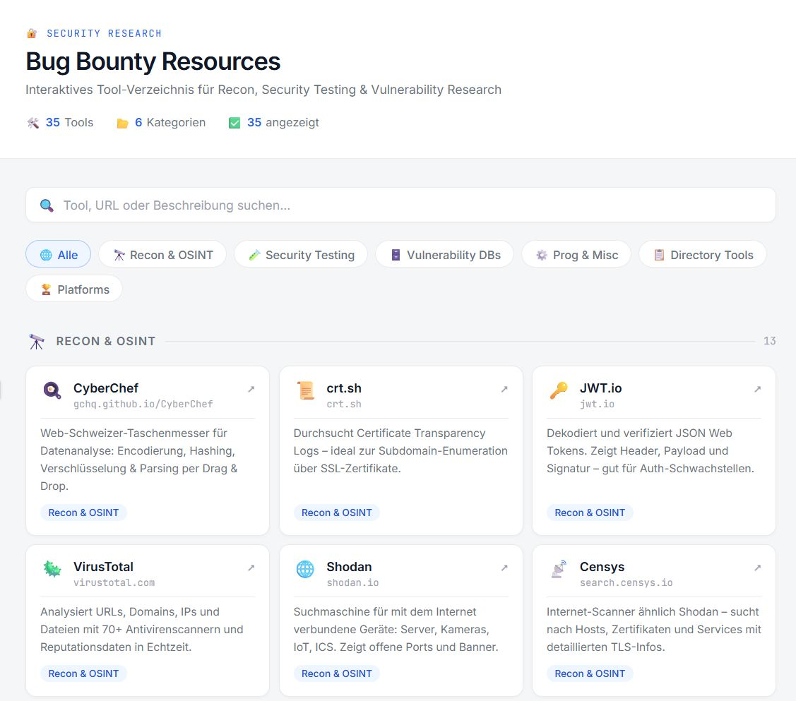

# Bug Bounty Resources Dashboard

Ein interaktives, offline-fähiges Tool-Verzeichnis für Bug-Bounty-Hunter und Security-Researcher.



## Features

- **35 Tools** aus 6 Kategorien
- Echtzeit-Suche über Name, URL und Beschreibung
- Filterbar nach Kategorie
- Direktlinks zu jedem Tool
- Kein Backend, kein Build-Step – läuft als einzelne HTML-Datei
- Dark Mode, vollständig responsiv

## Kategorien

| Kategorie | Beschreibung |
|---|---|
| Recon & OSINT | Subdomain-Enumeration, DNS, Cert Logs, Webarchiv |
| Security Testing | OWASP, Burp Suite, Exploit-DB, Cheat Sheets |
| Vulnerability DBs | Shodan-Alternativen, Tech-Stack-Erkennung |
| Prog & Misc | HTTP-Clients, WHOIS |
| Directory Tools | Bug-Bounty-Aggregatoren, DNS, Webhooks |
| Platforms | Foren, Checklisten, Payload-Sammlungen |

## Schnellstart

```bash
git clone https://github.com/DEIN-USERNAME/bug-bounty-dashboard.git
cd bug-bounty-dashboard
# Einfach index.html im Browser öffnen – fertig
```

Oder direkt hosten via **GitHub Pages**:

1. Repo auf GitHub pushen
2. Einstellungen → Pages → Branch: `main`, Ordner: `/root`
3. Unter `https://DEIN-USERNAME.github.io/bug-bounty-dashboard` erreichbar

## Lokale Nutzung

```bash
# Option 1: direkt öffnen
open index.html

# Option 2: lokaler Dev-Server
npx serve .
# oder
python3 -m http.server 8080
```

## Tools hinzufügen

In `index.html` das `tools`-Array erweitern:

```js
{
  name: "Tool Name",
  url: "example.com",
  href: "https://example.com",
  cat: "Recon & OSINT",   // eine der 6 Kategorien
  desc: "Kurze Beschreibung was das Tool macht."
},
```

## Lizenz

MIT – frei nutzbar, frei erweiterbar.

---

> Erstellt mit [Highfish AI](https://highfish.ai)
